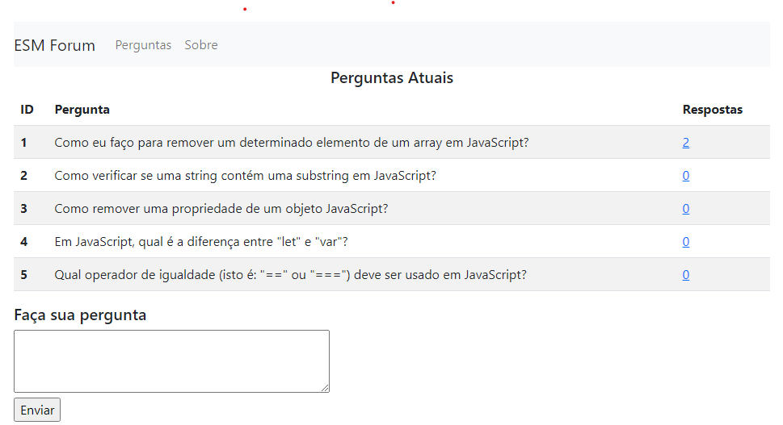

# ESM Forum

O **ESM Forum** é um sistema de demonstração do livro [Engenharia de Software Moderna](https://engsoftmoderna.info). 
Ele é um fórum simples de perguntas e respostas. O objetivo é permitir que os alunos tenham um primeiro contato prático com os conceitos estudados no livro. Ou seja:

* Trata-se de um sistema com objetivo didático e, por isso, não temos a intenção de colocá-lo em produção. 
* Também não temos a intenção de implementar um sistema completo, com todas as funcionalidades possíveis. 
* A interface Web do sistema é também simples e minimalista.

Veja a página principal do sistema:

Veja também a [página](docs/screen2.png) de respostas para uma pergunta.

## Tecnologias

O ESM Forum é implementado em JavaScript, usando:

  * Bootstrap, um framework para construção de interfaces Web em HTML e CSS.
  * Node.js, um sistema que permite a execução de programas JavaScript fora de browsers, isto é, em servidores.
  * Express, uma biblioteca para construção de aplicações Web em Node.js.
  * EJS, uma linguagem baseada em JavaScript para criação de templates HTML.
  * SQLite, um banco de dados relacional simples.

## Instalação e Execução

Veja neste [link](docs/instalacao.md).

## Praticando o Conteúdo do Livro

* Cap. 2 e 3: [histórias e backlog](https://github.com/users/mtov/projects/1), via GitHub Projects.
* Cap. 4: [diagramas de sequência](docs/uml.md), mostrando os principais fluxos de chamadas de funções do sistema.

