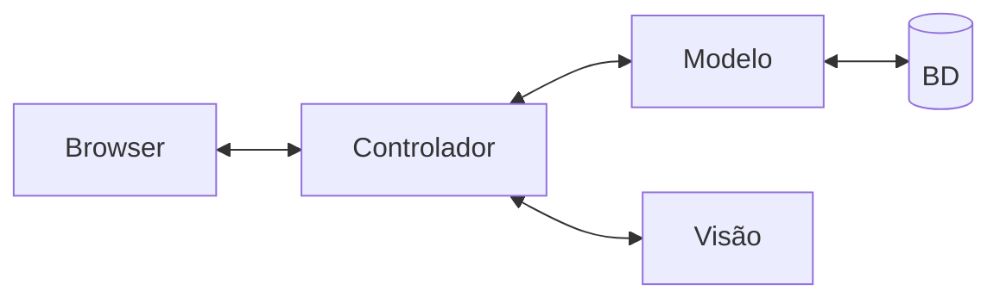
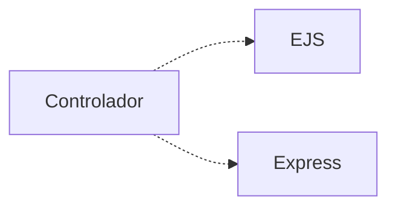

# Arquitetura

O ESM Forum segue uma arquitetura MVC. Esse padrão arquitetural é explicado no [Capítulo 7](https://engsoftmoderna.info/cap7.html#arquitetura-mvc) do livro.

A seguinte figura descreve a arquitetura do sistema:

Nessa arquitetura, temos os seguintes componentes:

* **Browser**, que exibe as páginas e realiza a interação com os usuários do sistema.

* **Controlador**, que é responsável por toda a mediação entre o browser e o restante do sistema. Como o ESM Forum é muito simples, o controlador é implementado em um único arquivo, chamado [server.js](../server.js).

* **Modelo**, que implementa a lógica e as funções de negócio do sistema. Também cuida de recuperar e persistir as perguntas e respostas no banco de dados. No ESM Forum, o modelo é  implementado em um único arquivo, chamado [modelo.js](../modelo.js).

* **Visão**, que são as páginas exibidas no browser. Essas páginas incluem código HTML e também código JavaScript para, por exemplo, criar dinamicamente as tabelas de perguntas e respostas. As páginas da Visão estão no seguinte [diretório](../visao).

* **Banco de dados**, que no caso do ESM Forum é o [SQLite](https://www.sqlite.org). O esquema do banco de dados está no arquivo [schema.sql](../bd/schema.sql).

Detalhando um pouco mais, o controlador faz uso de duas bibliotecas externas, conforme ilustrado abaixo:

O [EJS](https://ejs.co) é uma biblioteca usada para pré-processar o código JavaScript embutido nas páginas da Visão. Com isso, a página que é enviada para o browser possui todos os dados que serão exibidos para os usuários, sem necessidade de qualquer processamento.

Já o [Express](https://expressjs.com) é usado para definir uma pequena API REST. Ou seja, na nossa arquitetura, graças ao Express, o controlador é um servidor Web que fica continuamente recebendo e tratando requisições HTTP enviadas por um browser.

## API do Servidor

 A API REST do controlador ( implementada usado o Express) oferece os seguintes endpoints:

* ``GET /``: usado para obter a [página principal](./screen1.png) do sistema com a lista de perguntas. O resultado é uma pagina HTML resultante do processamento do arquivo de visão [index.ejs](../visao/index.ejs).

* ``POST /perguntas``: usado para cadastrar uma pergunta. Ou seja, esse endpoint é usado para enviar informações do browser para o servidor. O texto propriamente dito da pergunta é enviado como um parâmetro, chamado `pergunta`, de um formulário.

* ``GET /respostas/?id_pergunta=n``: usado para obter a lista de respostas de uma pergunta cujo identificador é `n`. O resultado é uma página HTML resultante do processamento do arquivo [respostas.ejs](../visao/respostas.ejs).
Veja que o parâmetro é codificado na própria query, isto é, na URL do endpoint.

* ``POST /respostas``: usado para cadastrar uma resposta para uma pergunta.
Devem ser enviados dois parâmetros (*form-encoded*): `id_pergunta` (isto é, o id da pergunta que estamos respondendo) e `resposta` (isto é, o texto da nossa resposta).

## Exercício

Teste os endpoints acima usando uma ferramenta 
como o [Thunder Client](https://marketplace.visualstudio.com/items?itemName=rangav.vscode-thunder-client). 
Ele é um plugin para o VS Code que permite submeter facilmente requisições para uma
API REST e ver os resultados retornados. 

Outra opção de ferramenta é o [Postman](https://www.postman.com/).

Qualquer que seja a ferramenta que usar, acesse e teste cada um dos endpoints acima. Mas antes se certifique de que o backend (``server.js``) está rodando.

Observação: se tiver problemas de conexão entre o Thunder Client e o servidor, experimente trocar o endereço `localhost:3000` por `[::1]:3000`. Existem diversos posts na Internet que explicam melhor esse problema...