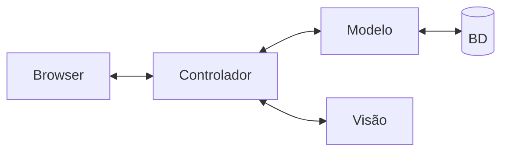
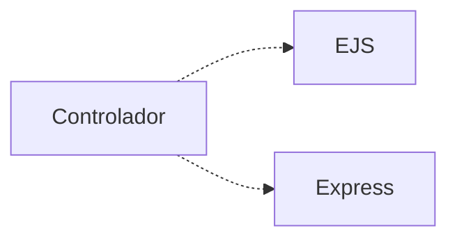

# Diagramas de Sequência

O ESM Forum segue uma arquitetura MVC. Este padrão arquitetural é explicado no [Capítulo 4](https://engsoftmoderna.info/cap7.html#arquitetura-mvc) do livro.

A figura abaixo ilustra essa arquitetura:

Nesta arquitetura, temos os seguintes componentes:

* **Browser**, que exibe as páginas e realiza a interação com os usuários do sistema.

* **Controlador**, que é responsável por toda a mediação entre o browser e o restante do sistema. Como o ESM Forum é muito simples, o controlador é implementado em um único arquivo, chamado [server.js](../server.js).

* **Modelo**, que implementa a lógica e funções de negócio do sistema. Também cuida de recuperar e persistir as perguntas e respostas no banco de dados. No ESM Forum, o modelo é  implementado em um único arquivo, chamado [modelo.js](../modelo.js).

* **Visão**, que são as páginas exibidas no browser. No entanto, essas páginas não incluem apenas HTML, mas também código JavaScript, para, por exemplo, criar dinamicamente as tabelas com as perguntas e respostas. As páginas da Visão estão no seguinte [diretório](../views).

* **Banco de dados**, que no caso do ESM Forum é o SQLite. O esquema do banco de dados pode ser visto no arquivo [schema.sql](../bd/schema.sql).

Detalhando um pouco mais, o controlador faz uso de duas bibliotecas externas, conforme ilustrado abaixo:

O EJS é uma biblioteca usada para processar o código JavaScript embutido nas páginas da Visão. Com isso, a página que é enviada para o browser já possui todos os dados que serão exibidos para os usuários, sem necessidade de qualquer processamento.

Já o Express é usado para definir uma pequena API REST. Ou seja, na nossa arquitetura, graças ao Express, o controlador é na verdade um servidor Web que fica continuamente recebendo e tratando requisições HTTP enviadas por um browser. A API REST disponibilizada pelo controlador possui os seguintes endpoints:

* ``GET /``: usado para obter a página principal com a lista de perguntas.

* ``POST /perguntas``: usado para cadastrar uma pergunta.

* `` GET /respostas/?id_pergunta=xx``: usado para obter a lista de respostas de uma pergunta cujo identificado é `xx`.

* ``POST /respostas``: usado para cadastrar uma resposta para uma determinada pergunta.

