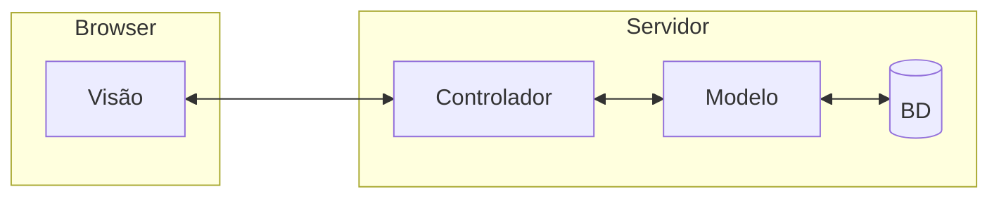
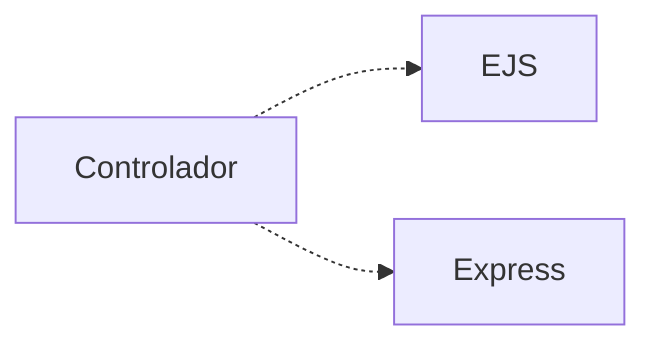

# Arquitetura

O ESM Forum segue uma variação da arquitetura MVC, na qual a visão é uma Single Page Application, implementada usando React. 
Esse padrão arquitetural é explicado no [Capítulo 7](https://engsoftmoderna.info/cap7.html#arquitetura-mvc) do livro.

A seguinte figura descreve a arquitetura do sistema:



Nessa arquitetura, temos os seguintes componentes:

* **Visãor**, que é responsável pela UI do sistema. No nosso caso, a Visão é uma aplicação Web interativa, isto é, uma Single Page Application (SPA), implementada usando-se a
biblioteca React. Como afirmamos na página principal, o código da Visão está em um [repositório](https://github.com/mtov/esmforum-react) separado.
 
* **Controlador**, que é responsável por toda a mediação entre a Visão e o restante do sistema. Como o ESM Forum é muito simples, o controlador é implementado em um único arquivo, chamado [server.js](../server.js). Essa implementação usa a biblioteca [Express](https://expressjs.com) para definir uma pequena API REST. Ou seja, na nossa arquitetura, o controlador é um servidor Web que fica continuamente recebendo e tratando requisições HTTP enviadas por um browser.

* **Modelo**, que implementa a lógica e as funções de negócio do sistema. Também cuida de recuperar e persistir as perguntas e respostas no banco de dados. No ESM Forum, o modelo é  implementado em um único arquivo, chamado [modelo.js](../modelo.js).

* **Banco de dados**, que no caso do ESM Forum é o [SQLite](https://www.sqlite.org). O esquema do banco de dados está no arquivo [schema.sql](../bd/schema.sql).

<!---
Detalhando um pouco mais, o controlador faz uso de duas bibliotecas externas, conforme ilustrado abaixo:




O [EJS](https://ejs.co) é uma biblioteca usada para pré-processar o código JavaScript embutido nas páginas da Visão. Com isso, a página que é enviada para o browser possui todos os dados que serão exibidos para os usuários, sem necessidade de qualquer processamento.
--->


## API do Servidor

 A API REST do controlador (implementada usado o Express) oferece os seguintes endpoints:

* ``GET /``: usado para obter as perguntas da página principal do ESM Forum. O resultado é um documento JSON com uma lista das perguntas cadastradas no sistema. Segue um exemplo dos campos deste documento:

```
{
  id_pergunta: 1,
  texto: 'Como eu faço para remover um determinado elemento de um array em JavaScript?',
  id_usuario: 1,
  num_respostas: 2
}
```


* ``POST /perguntas``: usado para cadastrar uma pergunta. Ou seja, esse endpoint é usado para enviar informações da Visão para o servidor. A pergunta a ser cadastrada é enviada em um documento JSON como neste exemplo:

```
{ pergunta: 'Quanto é 2 + 2?' }
```

* ``GET /respostas/?id_pergunta=n``: usado para obter as respostas de uma pergunta cujo identificador é `n`. O resultado é documento JSON como o seguinte:

```
{
  pergunta: { id_pergunta: 6, texto: 'Quanto é 2 + 2?', id_usuario: 1 },
  respostas: [
    { id_resposta: 3, id_pergunta: 6, texto: '4' },
    { id_resposta: 7, id_pergunta: 6, texto: '5' }
  ]
}
```

* ``POST /respostas``: usado para cadastrar uma resposta para uma pergunta. Devem ser enviado um documento JSON tal como neste exemplo:

```
{ id_pergunta: '6', resposta: '2' }
```

## Exercício

Teste os endpoints acima usando uma ferramenta 
como o [Thunder Client](https://marketplace.visualstudio.com/items?itemName=rangav.vscode-thunder-client). 
Ele é um plugin para o VS Code que permite submeter facilmente requisições para uma
API REST e ver os resultados retornados. 

Outra opção de ferramenta é o [Postman](https://www.postman.com/).

Qualquer que seja a ferramenta que usar, acesse e teste cada um dos endpoints acima. Mas antes se certifique de que o backend (``server.js``) está rodando.

Observação: se tiver problemas de conexão entre o Thunder Client e o servidor, experimente trocar o endereço `localhost:3000` por `[::1]:3000`. Existem diversos posts na Internet que explicam melhor esse problema...
