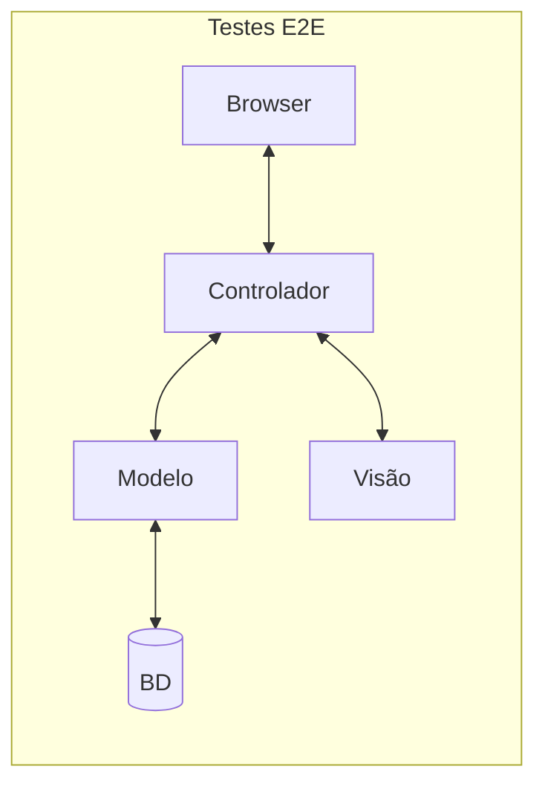

# Testes End-to-End

O ESM Forum possui alguns testes end-to-end, também conhecidos como 
testes de frontend ou testes de sistema.  Para mais informações, 
consulte o 
[Capítulo 8](https://engsoftmoderna.info/cap8.html#testes-de-sistema). Veja também a seguinte ilustração:



Os testes end-to-end são implementados usando-se o Cypress e estão em 
dois arquivos:

* [spec1.js](../testes/cypress/integration/spec1.js): um teste usado apenas para checar se a execução do Cypress 
está ocorrendo com sucesso.

* [spec2.js](../testes/cypress/integration/spec2.js): um teste mais 
real e que testa o cadastro de uma pergunta.

## Executando os testes end-to-end

Como o Cypress é uma ferramenta mais complexa e com diversas 
dependências, iremos executá-la por meio de um container Docker.

Ou seja, você primeiro terá que instalar o Docker, conforme 
descrito [aqui](https://docs.docker.com/get-docker/).

Feito isso, coloque o servidor no ar, com um banco de dados 
pré-configurado para o teste:

```
cd bd
rm esmforum.db
cp esmforum-original.db esmforum.db
cd ..
node server
```

Uma mensagem vai aparecer no terminal, indicando que o servidor 
está no ar.

Em seguida, abra um outro terminal para executar os testes 
end-to-end:

```
cd testes
./run-cypress.sh
```

Esse script executa um container Docker com uma imagem do Cypress. 
A primeira execução irá demorar um pouco, pois a imagem tem que 
ser baixada.

Evidentemente, é interessante analisar toda a saída gerada pelo Cypress. 
Mas, o mais importante, é que no final constará a mensagem: 

> All tests passed!

## Exercício

Implemente um terceiro teste end-to-end. Por exemplo, você pode testar
agora o cadastro de uma resposta.
Implemente o seu teste em um arquivo chamado ``spec3.js`` e salve-o na mesma pasta dos testes anteriores. Assim, o nosso script irá executá-lo automaticamente ao ser chamado.

