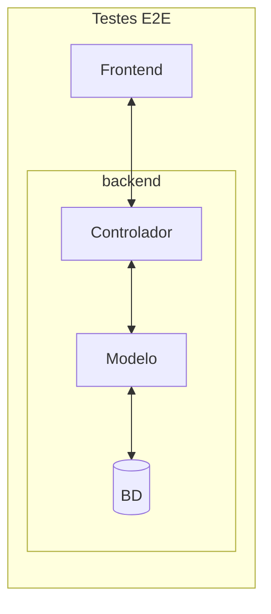

# Testes End-to-End

O ESM Forum possui alguns testes end-to-end, também conhecidos como 
testes de frontend ou testes de sistema.  Para mais informações, 
consulte o 
[Capítulo 8](https://engsoftmoderna.info/cap8.html#testes-de-sistema). Veja também o seguinte diagrama, por meio do qual tentamos mostrar que esses testes cobrem todo o código do sistema.

Para entender melhor, você pode comparar o diagrama acima com o 
diagrama análogo para [testes de integração](./testes-integracao.md).

## Implementação

Atualmente, o ESM Forum possui um teste end-to-end, implementado no seguinte arquivo.

* [spec2.js](../testes/e2e/cypress/e2e/spec.cy.js): testa o cadastro de uma pergunta.

## Executando os testes end-to-end

1. Primeiro, você deve instalar o Cypress, conforme descrito [aqui](https://docs.cypress.io/guides/getting-started/installing-cypress).

   Veja que você pode instalar o Cypress como um pacote do npm/node.js. Ou então, pode instalar uma versão nativa do seu sistema operacional, conforme descrito [aqui](https://docs.cypress.io/guides/getting-started/installing-cypress#Direct-download). Esaa segunda alternativa pode ser mais simples e rápida, caso não tenha experiência com npm e node.js

2. Em seguida, execute o Cypress (por exemplo, clicando em cypress.exe, caso tenha feito uma instalação local).

3. Primeiro, você vai ter que abrir um projeto que está no seguinte diretório: ``testes/e2e''

   Ou seja, informe o diretório acima para o Cypress. Para ter certeza de que está informando o diretório certo, ele é o diretório que contem o arquivo `cypress.config.js`.

4. Depois, abra o projeto que foi criado pelo Cypress e informe que deseja executar testes E2E, usando o browser Chrome.

5. O Cypress vai abrir uma tela com os testes existentes, no nosso caso apenas `spec.cy.js`. Você poderá então pedir para executar esse teste e ver o seu resultado.
   
## Exercício

Implemente um segundo teste end-to-end para testar o cadastro de uma resposta. Implemente o seu teste em um arquivo chamado ``spec2.cy.js``.
