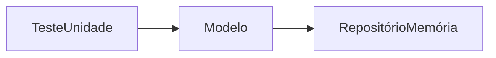

# Testes de Unidade

Na versão atual do ESM Forum, implementamos um teste de unidade para a função `listar_perguntas` da camada de Modelo.

Ele foi implementado usando o Jest e está no arquivo [listar_perguntas.test.js](../testes/listar_perguntas.test.js).

Para executar o teste, basta digitar na pasta raiz:

`npm test -- listar_perguntas.test.js`

## Explicação do Teste

A implementação de [listar_perguntas](../modelo.js) faz duas coisas:

* Chama a função `queryAll` para recuperar todas as perguntas cadastradas no sistema. Veja que para isso `queryAll` acessa o BD.
* Depois, para cada pergunta, chama-se a função `get_num_respostas` para recuperar seu número de respostas. Em seguida, essa informação é adicionada na lista de perguntas que será retornada.

Então, no teste de unidade, nós realizamos o **mock** de:

* `bd.queryAll()` para retornar sempre uma lista com respostas conhecidas.
* `bd.query()` para retornar os valores 5, 10 e 15, nessa ordem. Veja que 
`listar_perguntas` chama `get_num_respostas`, que chama `query` para
retornar o número de respostas de uma determinada pergunta.

Se quiser saber mais sobre Testes de Unidade, consulte a [Seção 8.2](https://engsoftmoderna.info/cap8.html#testes-de-unidade) do livro. E para saber mais sobre mocks consulte a [Seção 8.6](https://engsoftmoderna.info/cap8.html#mocks).

### Exercício

No nosso teste de unidade, foram mockadas: (a) a lógica para 
recuperar todas as perguntas do BD; (b) a lógica para recuperar 
o número de respostas de uma pergunta. Então, o que exatamente
  o teste irá testar? Em outras palavras, qual  lógica restou 
em `listar_perguntas` e que está sendo testada?

## Criando uma Camada de Repositórios

No teste de unidade explicado acima, "mockamos" as
funções de acesso ao banco de dados. O problema dessa solução é que 
`queryAll` e `query` podem ser usadas por outras funções da 
camada de Modelo. Por exemplo, como "mockamos" `query` para atender
apenas ao teste de `listar_perguntas`, nosso mock pode não ser útil para testar outras funções.

Uma solução mais genérica consiste na criação de uma camada
intermediária entre o modelo e o banco de dados, normalmente 
chamada de **repositório**. Basicamente, um repositório
oferece funções de mais alto nível para acessar um banco de dados 
(do que, por exemplo, as funções `queryAll` e `query`).

Por exemplo, poderíamos criar um repositório de perguntas 
com as seguintes funções:

````javascript
recuperar_todas_perguntas(); 
recuperar_pergunta(id_pergunta);
recuperar_todas_respostas(id_pergunta);
recuperar_num_respostas(id_pergunta);
criar_pergunta(texto);
criar_resposta(id_pergunta, texto);
````

Então teríamos a seguinte sequência de chamadas:


Assim, o código SQL que hoje está implementado nas funções de 
Modelo seria movido para funções da camada de Repositório.

### Qual a vantagem de usar Repositórios?

Repositórios facilitam a escrita de testes de unidade, pois 
podemos criar um novo tipo de repositório que manipula e recupera dados em memória principal. Sendo mais específico, 
teríamos dois tipos de repositórios: `RepositórioBD` e
`RepositórioMemória`, sendo que esse último manipula
algumas poucas perguntas e será utilizado apenas quando o Modelo for chamado pelos testes de unidade.



Veja que na figura acima não existe mais BD, pois nosso objetivo é 
implementar de forma mais fácil um teste de unidade.

Se quiser saber mais sobre repositórios, recomendamos que leia nosso artigo didático sobre [Domain-Driven Design (DDD)](https://engsoftmoderna.info/artigos/ddd.html).

### Exercício

Implemente uma camada de Repositório no ESM Forum, com os dois 
tipos de repositório que mencionamos acima: `RepositorioBD` e `RepositorioMemoria`. Seguem algumas dicas:
*  Ambos os repositórios vão implementar as funções que mencionamos anteriormente. Porém, algumas implementações podem ser vazias, caso não sejam necessárias no teste.
* As implementações de `RepositorioBD` vão usar SQL.
* As implementações de `RepositorioMemoria` vão usar uma lista conhecida de perguntas, armazenadas em memória principal (de forma parecida com a implementação [atual](../testes/listar_perguntas.test.js) do teste de unidade). Por outro lado, não há necessidade de usar mocks criados pelo Jest na implementação de `RepositorioMemoria`.
* No modelo, modifique a função [reconfig_bd](../modelo.js) para reconfigurar o repositório usado pelo modelo (e não mais o BD). Ou seja, essa função deve passar a ter o nome `reconfig_repositorio`.
