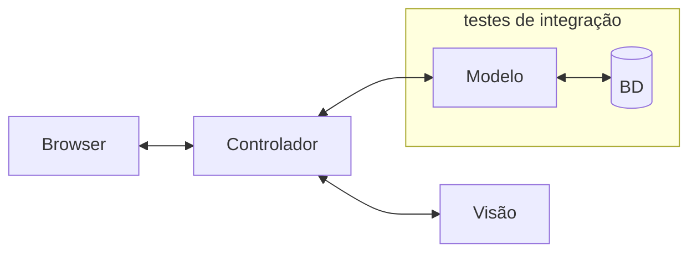

# Testes de Integração

O ESM Forum possui alguns testes de integração, implementados usando o Jest. Eles estão no seguinte [arquivo](../testes/modelo.test.js).

Esses testes de integração testam a camada de modelo e o acesso da mesma ao banco de dados, como ilustrado a seguir:

## Executando os testes de integração

Digite na pasta raiz do projeto:

``npm test``

Para ver a cobertura dos testes, digite:

``npm test -- --coverage`` 

## Exercício

Após o rodar o comando acima, você vai perceber que a cobertura de comandos (Stmts) do arquivo `modelo.js` é de 78.94%.

Implemente então um ou mais casos de testes, sempre no arquivo [modelo.test.js](../testes/modelo.test.js), de forma que essa cobertura atinja 100%.
