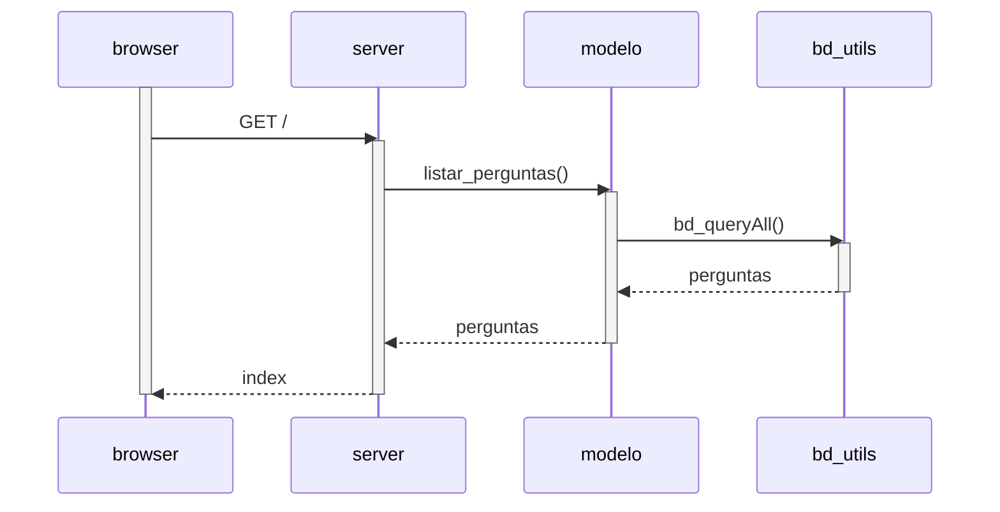

# Diagramas de Sequência

## Listar Perguntas



## Cadastrar Pergunta

```mermaid
    sequenceDiagram
        activate browser
	browser->>server: POST perguntas 
        activate server
        server->>modelo: cadastr_pergunta()
        activate modelo
        modelo->>bd_utils: bd_exec()
        activate bd_utils
        bd_utils-->>modelo
        deactivate bd_utils
        modelo-->>server
        deactivate modelo
	server-->>browser: pergunta-sucesso
	deactivate server
	deactivate browser
```	

