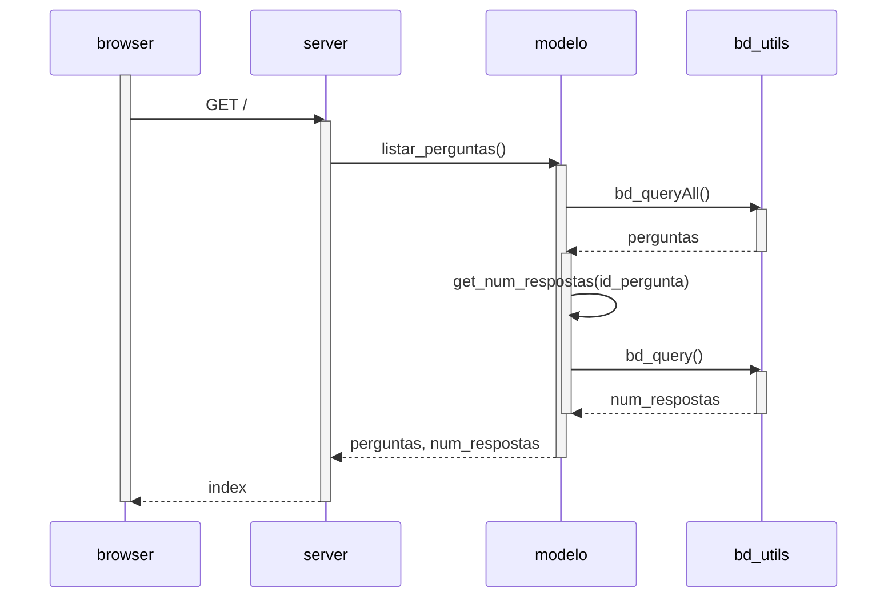
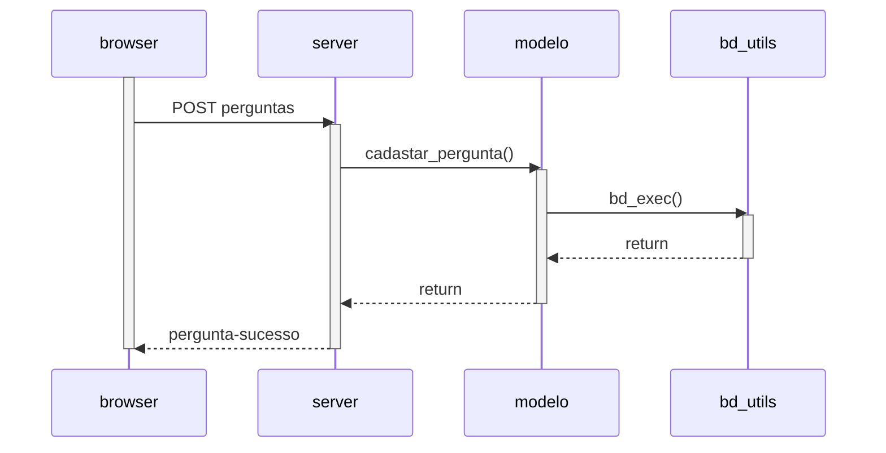
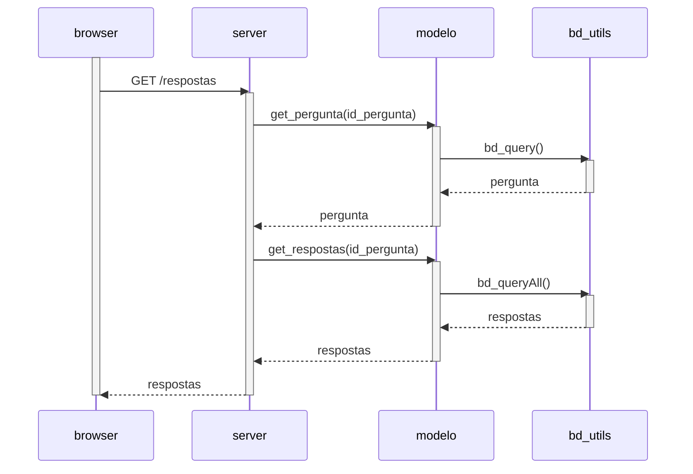

# Diagramas de Sequência

## Listar Perguntas

```mermaid
    sequenceDiagram
        activate browser
	browser->>server: GET / 
        activate server
        server->>modelo: listar_perguntas()
        activate modelo
        modelo->>bd_utils: bd_queryAll()
        activate bd_utils
        bd_utils-->>modelo: perguntas
        deactivate bd_utils
	activate modelo
	modelo->>modelo: get_num_respostas(id_pergunta)
	modelo->>bd_utils: bd_query()
        activate bd_utils
        bd_utils-->>modelo: num_respostas
        deactivate bd_utils
	deactivate modelo
        modelo-->>server: perguntas, num_respostas
        deactivate modelo
	server-->>browser: index
	deactivate server
	deactivate browser
```	

## Cadastrar Pergunta

```mermaid
    sequenceDiagram
        activate browser
	browser->>server: POST perguntas 
        activate server
        server->>modelo: cadastar_pergunta()
        activate modelo
        modelo->>bd_utils: bd_exec()
        activate bd_utils
        bd_utils-->>modelo: return
        deactivate bd_utils
        modelo-->>server: return
        deactivate modelo
	server-->>browser: pergunta-sucesso
	deactivate server
	deactivate browser
```	

## Listar Respostas (de uma Pergunta)

```mermaid
    sequenceDiagram
        activate browser
	browser->>server: GET /respostas
        activate server
        server->>modelo: get_pergunta(id_pergunta)
        activate modelo
        modelo->>bd_utils: bd_query()
        activate bd_utils
        bd_utils-->>modelo: pergunta
        deactivate bd_utils
        modelo-->>server: pergunta
        deactivate modelo
	server->>modelo: get_respostas(id_pergunta)
        activate modelo
        modelo->>bd_utils: bd_queryAll()
        activate bd_utils
        bd_utils-->>modelo: respostas
        deactivate bd_utils
        modelo-->>server: respostas
        deactivate modelo
	server-->>browser: respostas
	deactivate server
	deactivate browser
```	

