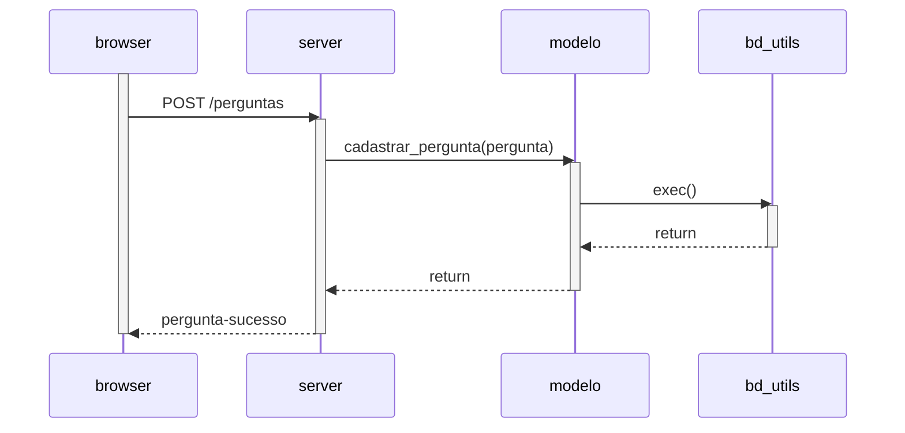

# Diagramas de Sequência

Veja a seguir alguns diagramas de sequência para as operações principais do sistema.
Para saber mais sobre esses diagramas, recomendamos o [Capítulo 4](https://engsoftmoderna.info/cap4.html#diagrama-de-sequ%C3%AAncia) do livro.

## Listar Perguntas

## Cadastrar Pergunta

## Listar Respostas (de uma pergunta)

## Exercício

Crie um diagrama de sequência ilustrando os métodos chamados quando se cadastra uma pergunta no ESM Forum.

Dica: os diagramas anteriores foram criados em Markdown usando a ferramenta [Mermaid](https://mermaid-js.github.io/mermaid/#/sequenceDiagram), que é suportada nativamente pelo GitHub.
